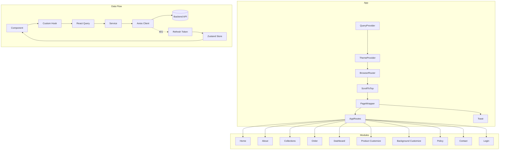
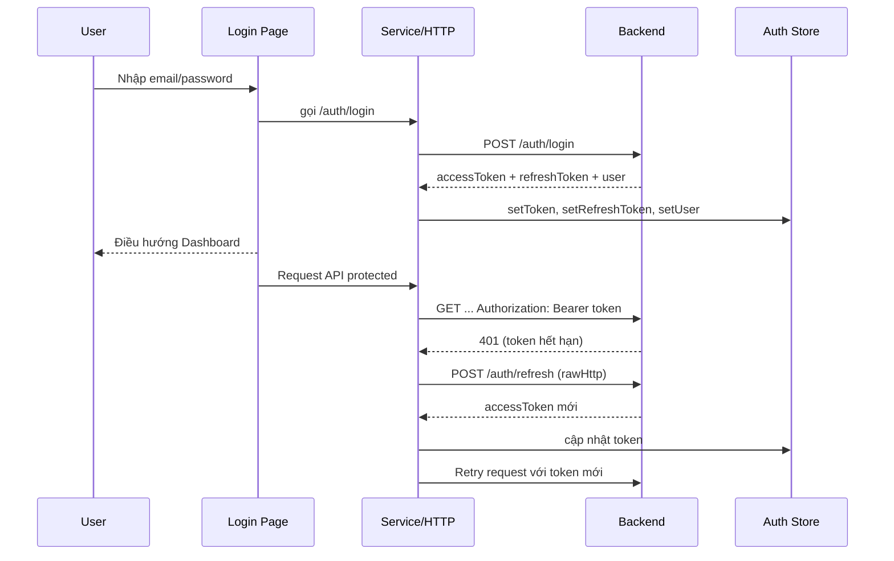

# Soligant Client – Tài liệu mô tả chi tiết

## Tổng quan
- Ứng dụng frontend xây dựng bằng `React` + `TypeScript`, đóng gói với `Vite`.
- UI sử dụng `MUI` kết hợp `styled-components` và `SCSS modules` để tạo giao diện hiện đại, nhất quán.
- Dữ liệu bất đồng bộ quản lý bằng `@tanstack/react-query` (cache, retry, trạng thái tải), state cục bộ và phiên đăng nhập lưu bằng `zustand`.
- Kết nối API qua `axios` với interceptor xử lý token, tự động làm mới (`refresh token`).
- Định tuyến sử dụng `react-router-dom`, chia module theo tính năng trong `src/features`.
- Hỗ trợ thông báo thời gian thực (đơn hàng/tư vấn) qua `socket.io-client`.

Thành phần khởi tạo chính: `src/App.tsx:68-83`.

## Công nghệ & Thư viện
- React 19, React Router 7, TypeScript 5, Vite 7
- UI: `@mui/material`, `@mui/icons-material`, `@emotion`, `styled-components`, `sass`
- State: `@tanstack/react-query`, `zustand`, `react-hook-form`
- HTTP: `axios`
- Realtime: `socket.io-client`
- Tiện ích: `date-fns`, `uuid`, `react-toastify` (nội bộ dùng MUI Snackbar)

Scripts: xem `client/package.json:6-11`.

## Cấu trúc thư mục
```
client/
├─ src/
│  ├─ assets/                # fonts, images, styles global
│  ├─ components/            # components dùng chung (guards, header, toast...)
│  ├─ constants/             # hằng số (routes, api paths, colors, keys)
│  ├─ features/              # mỗi tính năng tự chứa pages, components, hooks...
│  ├─ hooks/                 # hooks chia sẻ (permissions, promotions, notifications)
│  ├─ libs/                  # http client, query provider
│  ├─ routes/                # cấu hình tuyến đường tổng
│  ├─ store/                 # trạng thái ứng dụng bằng zustand (auth, toast, cart)
│  ├─ utils/                 # tiện ích xử lý lỗi, http, quyền menu
│  └─ App.tsx                # khởi tạo theme, router, query provider
└─ index.html, package.json, eslint.config.js
```

Một số điểm neo:
- Router tổng: `src/routes/app.routes.tsx:14-27`
- Theme MUI: `src/App.tsx:12-66`
- Query provider: `src/libs/query-provider.libs.tsx:4-20`
- HTTP client + interceptor: `src/libs/http.libs.ts:42-174`
- Guard đăng nhập: `src/components/auth-guard.components.tsx:6-19`
- Guard phân quyền: `src/components/permission-guard.component.tsx:20-104`
- Hằng số tuyến đường: `src/constants/route-path.constants.ts:1-31`
- Hằng số API: `src/constants/api-path.constants.ts:1-125`
- Phân quyền: `src/constants/permissions.constants.ts:1-125`, hook `src/hooks/use-permissions.hook.ts:9-74`

## Kiến trúc ứng dụng
- Providers:
  - `QueryClientProvider` cấu hình retry, refetch: `src/libs/query-provider.libs.tsx:4-11`.
  - `ThemeProvider` cấu hình palette, typography: `src/App.tsx:12-66`.
- Routing: sử dụng `useRoutes` để gom tuyến theo module: `src/routes/app.routes.tsx:14-27`.
- API Layer: `axios` với `baseURL` từ `VITE_API_URL`, interceptor thêm `Authorization` và luồng refresh token: `src/libs/http.libs.ts:42-174`.
- State:
  - `useAuthStore` lưu `token`, `refreshToken`, `user` và persist: `src/store/auth.store.ts:32-55`.
  - `useToastStore` hiển thị thông báo MUI Snackbar: `src/store/toast.store.ts:11-18`, component `src/components/toast.components.tsx:5-19`.
- Phân quyền: `PermissionGuard` kiểm tra quyền qua hook `usePermissions` dùng `react-query` lấy quyền từ API: `src/hooks/use-permissions.hook.ts:12-24,32-36`.

### Sơ đồ kiến trúc (Mermaid)


## Luồng dữ liệu & lỗi
- Dữ liệu: Component -> Hook -> Query/Mutation -> Service -> HTTP -> API.
- Cache và đồng bộ: `react-query` (keys tại `src/constants/query-key.constants.ts`).
- Xử lý lỗi API và thông báo:
  - Thông báo tự động với `ToastStore` nếu không phải mutation: `src/libs/http.libs.ts:160-173`.
  - Chuẩn hóa thông báo lỗi qua `ErrorUtils`: `src/utils/error-handler.utils.ts:10-156`.

## Xác thực & Phân quyền
- Đăng nhập: hook form `src/features/login/hooks/use-login.hooks.tsx:5-19` gọi mutation `login`, lưu token và user vào `useAuthStore`.
- Interceptor:
  - Thêm `Authorization` nếu có token: `src/libs/http.libs.ts:42-55`.
  - Khi `401` sẽ dùng `rawHttp` gọi `API_PATHS.REFRESH` để lấy token mới, cập nhật store và retry request: `src/libs/http.libs.ts:87-139`.
- Guard routes:
  - `AuthGuard` chuyển hướng nếu chưa đăng nhập: `src/components/auth-guard.components.tsx:11-17`.
  - `PermissionGuard` kiểm tra quyền cụ thể theo `PAGE_PERMISSIONS`: `src/components/permission-guard.component.tsx:45-53` và `src/constants/permissions.constants.ts:104-125`.

### Trình tự xác thực (Mermaid)


## Thông báo thời gian thực
- Kết nối socket: `src/services/socket.service.ts:9-35`, namespace `/notifications`.
- Sự kiện: `new-order`, `order-status-updated`, `new-consultation`: `src/services/socket.service.ts:57-101`.
- Hook quản lý: `src/hooks/use-order-notifications.hook.ts:50-83,85-107,109-120`.
- Hiển thị: `src/components/order-notification-bell.components.tsx:30-46,159-201,204-556`.

## Giao diện & Theme
- Palette, typography, transitions cấu hình tại `src/App.tsx:12-66`.
- Font tại `src/assets/fonts` với `UTM-Avo`, `Barox`.
- SCSS modules cho từng section (ví dụ `features/home/components/*.module.scss`).

## Cài đặt & Chạy
- Yêu cầu Node.js 18+.
- Biến môi trường:
  - `VITE_API_URL`: URL backend (ví dụ `http://localhost:3000`).

Ví dụ `.env`:
```env
VITE_API_URL=http://localhost:3000
```

Lệnh:
- Phát triển: `npm run dev`
- Build: `npm run build`
- Preview: `npm run preview`
- Lint: `npm run lint`

## Chuẩn mã nguồn
- ESLint cấu hình tại `eslint.config.js`, tập trung vào React Hooks, TypeScript.
- Ưu tiên hooks theo nguyên tắc Single Responsibility, tách `queries`, `mutations`, `services` theo module.

## Các tính năng chính (modules)
- Trang công khai: Home, About, Collections, Policy, Contact, Product Customize, Background Customize, Order Tracking/Order.
- Dashboard: Users, Roles, Permissions, Products, Product Categories/Variants/Customs, Collections, Promotions, Shipping Fees, Inventory, Orders, Feedbacks, Informations, Consultations, Reports, Profile.
- Mỗi module gồm: `components`, `pages`, `routes`, `services`, `queries`, `mutations`, `hooks`, `types`, `constants`.

## Tuyến đường chính
Tham chiếu `src/constants/route-path.constants.ts:1-31`. Ví dụ:
- `/`, `/about`, `/collections`, `/contact`, `/policy`
- `/product-customize`, `/background-customize`, `/order`
- `/dashboard/*` và các nhánh quản trị: users, roles, products, orders, inventory, v.v.

Lưu ý: Đã loại bỏ tuyến đường `/dashboard/my-orders` (Đơn của tôi) khỏi hệ thống.

---
Tài liệu này nhằm giúp nắm bắt nhanh kiến trúc, công nghệ và luồng hoạt động của `client`. Xem các file tham chiếu để đi sâu từng phần.
